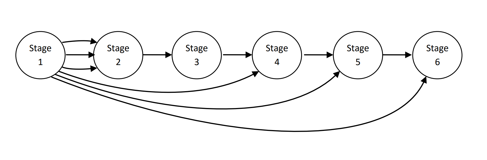
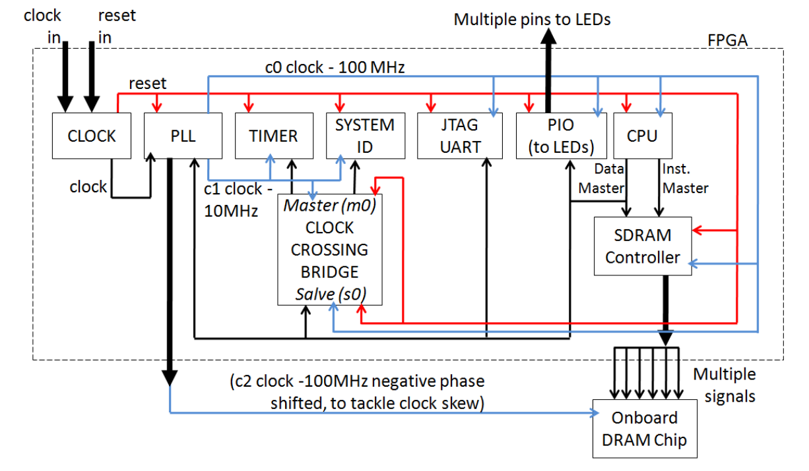

# MPSoC JPEG Encoder Pipeline - Altera DE2-115

A **hardware-software co-design** of a **6-stage pipelined Multi-Processor System-on-Chip (MPSoC)** for accelerating JPEG image encoding, implemented on an Altera Cyclone IV FPGA. This project integrates six independent soft-core processors communicating through dedicated hardware FIFO queues, achieving significant throughput gains over a sequential single-core implementation.

---

## Research Context

This architecture is grounded in academic research on heterogeneous multiprocessor synthesis:

> *Synthesis of Heterogeneous Pipelined Multiprocessor Systems Using ILP - JPEG Case Study*

The paper's ILP-based pipeline decomposition methodology was used directly as the architectural blueprint for this implementation, adapted for Altera Nios II soft-core processors and Quartus/Qsys tooling.

---

## System Architecture

The **JPEG_Encoder_MPSoC** implements a 6-stage heterogeneous pipeline. Each stage is assigned a dedicated Nios II/e processor and communicates downstream exclusively through hardware Avalon FIFO queues, ensuring strict backpressure management and zero shared-bus contention.

  

### Pipeline Stages

| Stage | Processor | Function |
|:---:|:---:|---|
| **1** | cpu_0 | Read macro-block from raw image; convert RGB → YCbCr |
| **2** | cpu_1 | Level shifting |
| **3** | cpu_2 | Vertical and horizontal Discrete Cosine Transform (DCT) |
| **4** | cpu_3 | Quantization |
| **5** | cpu_4 | Huffman encoding |
| **6** | cpu_5 | Write encoded macro-block to JPEG output file |

> **Memory Architecture:** Stage 1 is exclusively connected to the external SDRAM (via a PLL phase-shifted clock) to handle the large raw image buffer. Stages 2–6 operate entirely within tight **32 KB on-chip memory blocks** to fit within the Cyclone IV's M9K resource limits.

---

## Development Phases

This final pipeline was built through four iterative engineering phases. Each prototype is preserved in the `prototypes/` directory, forming a complete record of the hardware-software co-design journey.

---

### Phase 1 - Single-Core SoC

**`prototypes/01_Single_Core_SoC/`**

#### Part 1: Baseline SoC
Established the foundational Nios II SoC design flow: Qsys system integration, Avalon memory-mapped peripherals, BSP generation, and bare-metal C execution (LED counter).

#### Part 2: Sequential JPEG Encoder

The complete JPEG encoder was profiled running on a single Nios II core. This phase required non-trivial clock-domain engineering: a **PLL** was used to generate three clock signals (100 MHz CPU, 10 MHz peripherals, and a phase-shifted 100 MHz clock to resolve SDRAM clock skew), bridged by a **Clock Crossing Bridge** in Qsys.

  

The sequential baseline established the profiling data that justified the full multi-processor pipeline design.

---

### Phase 2 - Processor Customization (CRC Custom Instruction)

**`prototypes/02_Custom_Instruction/`**

A custom Verilog instruction was integrated directly into the Nios II ALU to perform **modulo-2 division** in hardware. This accelerated the **Cyclic Redundancy Check (CRC)** algorithm and validated the complete custom instruction integration workflow - from RTL design through Qsys component packaging to Eclipse BSP regeneration.

---

### Phase 3 - Multi-Processor SoC Design

**`prototypes/03_Basic_MPSoC/`**

#### Part 1: Shared Memory Producer-Consumer

A dual-core system (`cpu_0`, `cpu_1`) was designed with a **software FIFO queue** implemented within a shared on-chip memory partition. This required careful linker script configuration and synchronization flag management.

**Benchmark Result:** 96,061 tokens/sec throughput.

#### Part 2: Hardware FIFO

The shared memory was replaced with an **Altera On-Chip FIFO Memory** component in Qsys, with hardware-managed FULL/EMPTY status bits read directly from the Avalon CSR interface.

**Benchmark Result:** 215,982 tokens/sec throughput - a **2.25× speedup** over the software FIFO.

This validated the hardware FIFO as the correct inter-processor communication fabric for the final 6-stage pipeline.

---

### Final Project - JPEG MPSoC Design

**`JPEG_Encoder_MPSoC/`**

#### Part 1: Pipelined JPEG MPSoC

The 6-stage pipeline was assembled in Qsys with six Nios II/e processors, inter-stage Avalon FIFOs (three parallel FIFOs between Stage 1 and Stage 2 to stream Y, Cb, Cr independently), and six independent JTAG UARTs.

**Result:** A stable, functional pipeline generating correct **48.54 KB JPEG output images**.

> **Future Work:** Performance can be further improved by integrating hardware data/instruction caches on the bottleneck stages (DCT and Quantization) and implementing a custom Verilog accelerator for the quantization math. Strict FIFO backpressure locking will be required to prevent producer-consumer starvation when mixing processor speeds. A dedicated hardware logic analyser (rather than JTAG UART) would be needed to profile intermediate stage throughput without disrupting pipeline execution.

---

## Reports and Documentation

| Directory | Contents |
|---|---|
| [`reports/`](reports/) | Full engineering reports for each phase (methodology, results, debugging logs) |
| [`docs/`](docs/) | DE2-115 User Manual, Nios II Custom Instruction Guide, On-Chip FIFO Datasheet, and the ILP research paper |

---

## Setup and Execution Guide

### Prerequisites
- Quartus II (tested with version compatible with Cyclone IV EP4CE115F29C7N)
- Nios II EDS (Eclipse-based Software Build Tools)
- Altera DE2-115 FPGA board

---

### 1. Hardware Generation

1. Open `JPEG_Encoder_MPSoC/SoC.qsys` in **Platform Designer (Qsys)**.
2. Verify all 6 Nios II/e cores and inter-stage Avalon FIFOs are correctly memory-mapped with no base address conflicts.
3. Click **Generate HDL**.
4. Open `JPEG_Encoder_MPSoC/TopLevel.qsf` in **Quartus II** and compile the project.
5. Program the generated `.sof` bitstream to the DE2-115 via the Quartus Programmer.

---

### 2. Software Compilation

1. Open the **Nios II SBT for Eclipse** and set `JPEG_Encoder_MPSoC/software/` as the workspace.
2. Go to **File → Import → Existing Projects into Workspace** and import all 12 projects (6 application projects + 6 BSPs).
3. For **each of the 6 BSPs**, right-click → **Nios II → Generate BSP**, then open the **BSP Editor** and verify:
   - `sys_clk_timer` → assigned to the stage's dedicated interval timer
   - `enable_small_c_library` → **checked** (required for Stages 2–5 to fit in 32 KB RAM)
4. **Clean and Build** all 6 application projects.

---

### 3. Launching the Pipeline

Because this is a FIFO-coupled pipeline, downstream receivers must be running before upstream transmitters begin sending data. **Launch in strict reverse order:**

| Launch Order | Stage | Wait for console message |
|:---:|:---:|---|
| 1st | **Stage 6** | `Waiting for pipeline start...` |
| 2nd | **Stage 5** | Ready |
| 3rd | **Stage 4** | Ready |
| 4th | **Stage 3** | Ready |
| 5th | **Stage 2** | Ready |
| 6th | **Stage 1** | Begins data ingest → pipeline enters steady state |

> **Note:** Do not check *"Reset the processor"* in the Eclipse Run Configuration for any stage after the first boot. Doing so will wipe shared memory flags and desynchronize the pipeline.

---

## Contributors

| Contributor | GitHub | Contribution |
|---|---|---|
| Thakshila Bandara | [@its-thakshila](https://github.com/its-thakshila) | MPSoC Design (Phase 3) · JPEG Pipeline (Phase 4) |
| Prasadi Bandara | [@prasadibandara](https://github.com/prasadibandara) | Single-Core SoC (Phase 1) · Processor Customization (Phase 2) |

---

*Hardware: Altera Cyclone IV (EP4CE115F29C7N) · Toolchain: Quartus II, Nios II SBT · Languages: C (bare-metal), Verilog*
